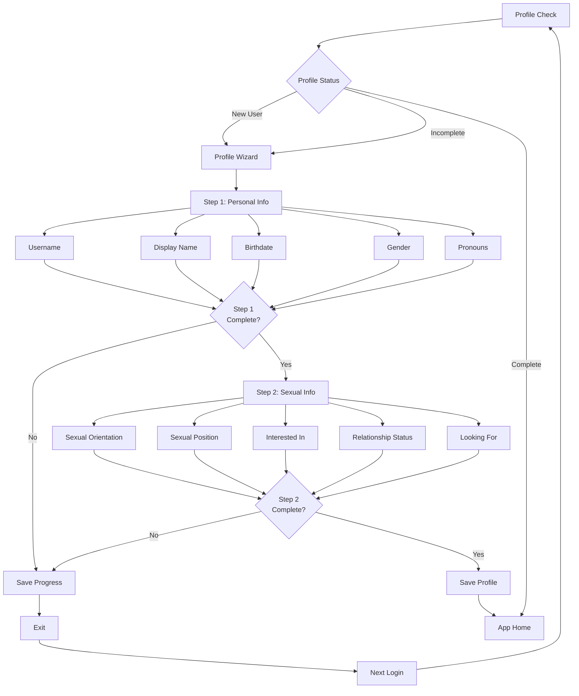

# Authentication Flow

## Directory Structure
- `src/app/(auth)` → Authentication pages (login, register)
- `src/app/(app)` → Protected pages (authenticated users only)
- `src/app` → Public pages

## Entry Points
- Email/password
- Phone number
- SSO (Google, Apple, Facebook)

## Flow Steps
1. **Authentication**
   - User logs in/registers via any entry point
   - System validates credentials

2. **Profile Check**
   - System verifies profile completion
   - New users → Profile Wizard
   - Incomplete profiles → Profile Wizard

3. **Profile Wizard**
   - Multi-step guided process with progress indicators
   - All fields are required for completion
   - Required completion before app access
   - Progress saved between sessions
   
   ### Step 1: Personal Information
   - Username (3-30 characters, unique, alphanumeric with dots and underscores)
   - Display Name (16 char limit)
   - Bio Text (240 char limit)
   - Birthdate (with age validation)
   - Gender (customizable selection)
   - Pronouns (customizable selection)
   
   ### Step 2: Sexual Information
   - Sexual Orientation (multi-select)
   - Sexual Position
   - Interested In (multi-select)
   - Relationship Status
   - Looking For (multi-select)

4. **Access Grant**
   - Complete profile → App-Home
   - Incomplete profile → Return to Profile Wizard

## Flow Diagrams

### Authentication Process

### Profile Wizard Flow

## Navigation
- **Auth Page** → Login/Register options
- **Profile Wizard** → Step-by-step profile setup
- **App-Home** → Main application access (verified users only)
