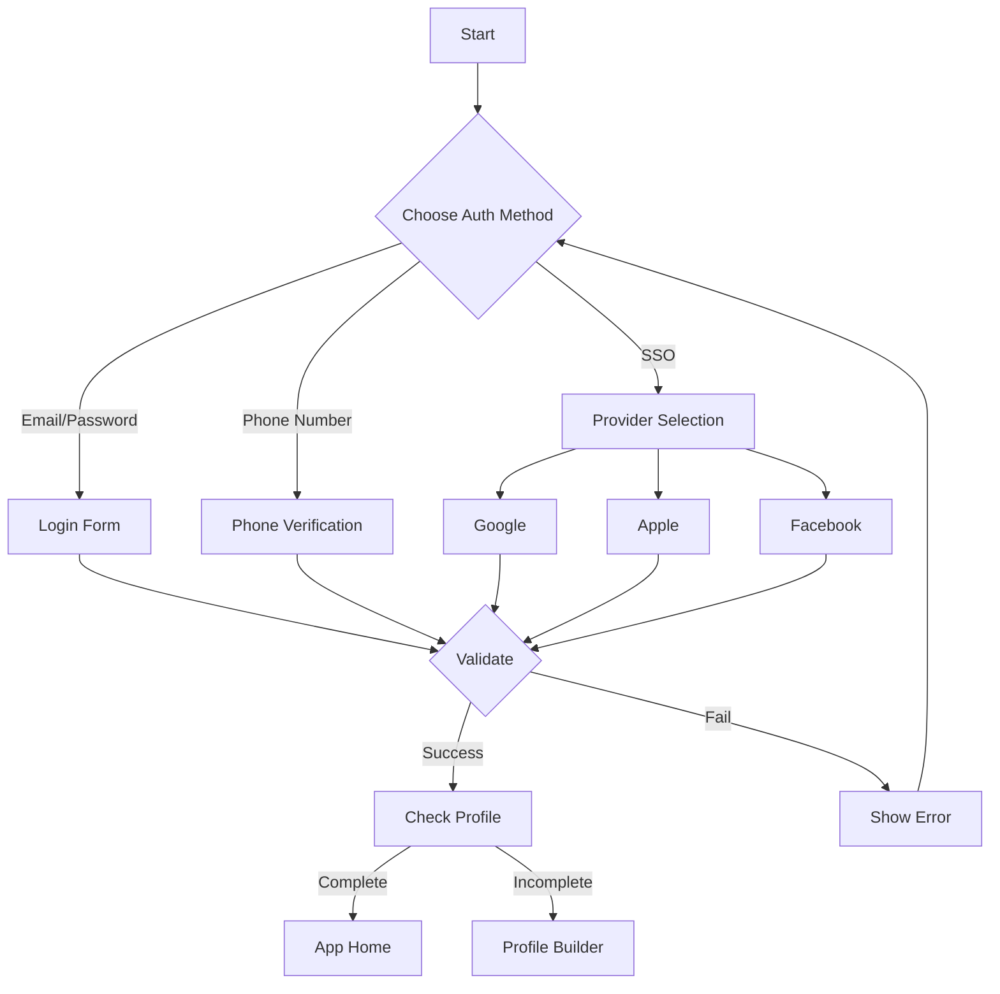
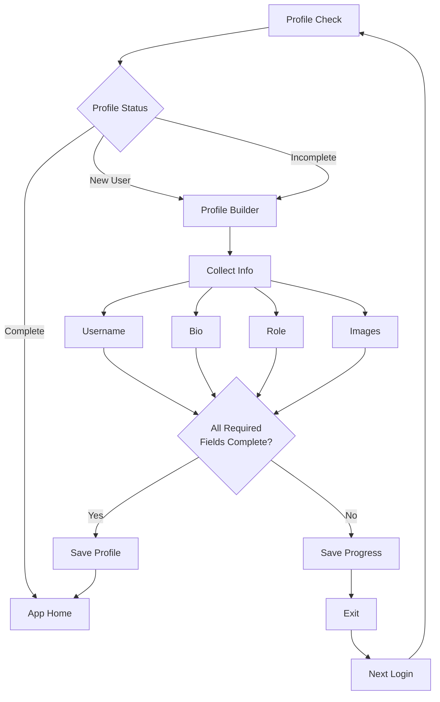

# Authentication Flow

## Directory Structure
- `src/app/(auth)` → Authentication pages (login, register)
- `src/app/(app)` → Protected pages (authenticated users only)
- `src/app` → Public pages

## Entry Points
- Email/password
- Phone number
- SSO (Google, Apple, Facebook)

## Flow Steps
1. **Authentication**
   - User logs in/registers via any entry point
   - System validates credentials

2. **Profile Check**
   - System verifies profile completion
   - New users → Profile Builder
   - Incomplete profiles → Profile Builder

3. **Profile Builder**
   - Collects: username, bio, role, images
   - Mandatory completion before app access
   - Progress saved between sessions

4. **Access Grant**
   - Complete profile → App-Home
   - Incomplete profile → Return to Profile Builder

## Flow Diagrams

### Authentication Process

### Profile Setup Flow

## Navigation
- **Auth Page** → Login/Register options
- **Profile Builder** → User data collection
- **App-Home** → Main application access (verified users only)
