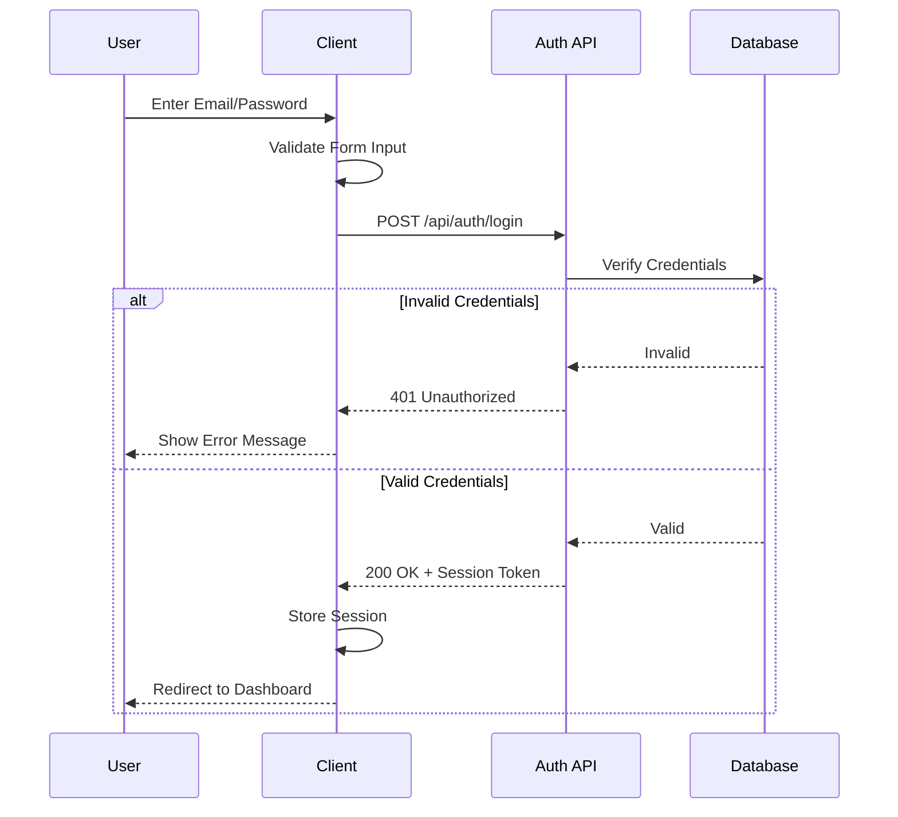
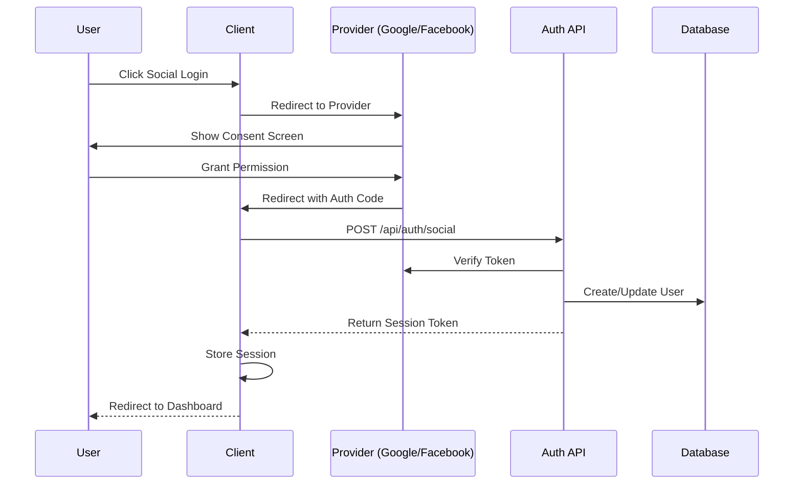
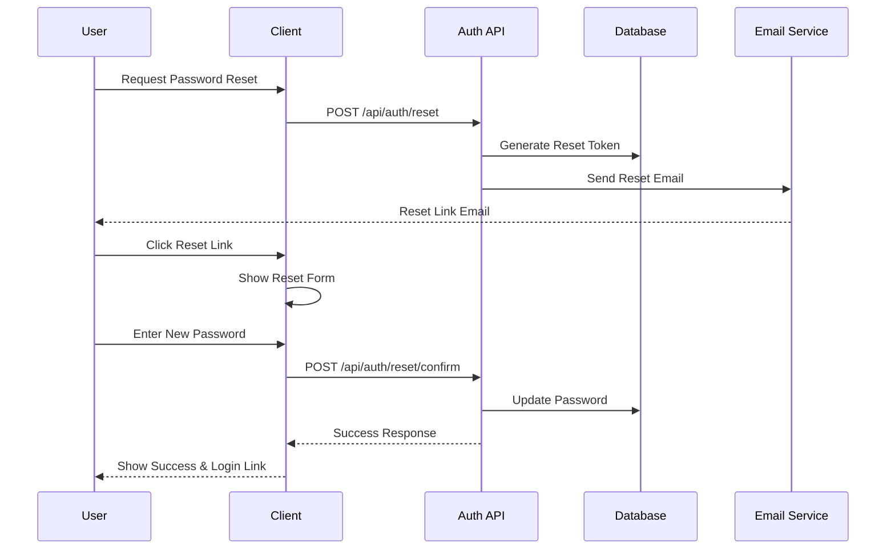
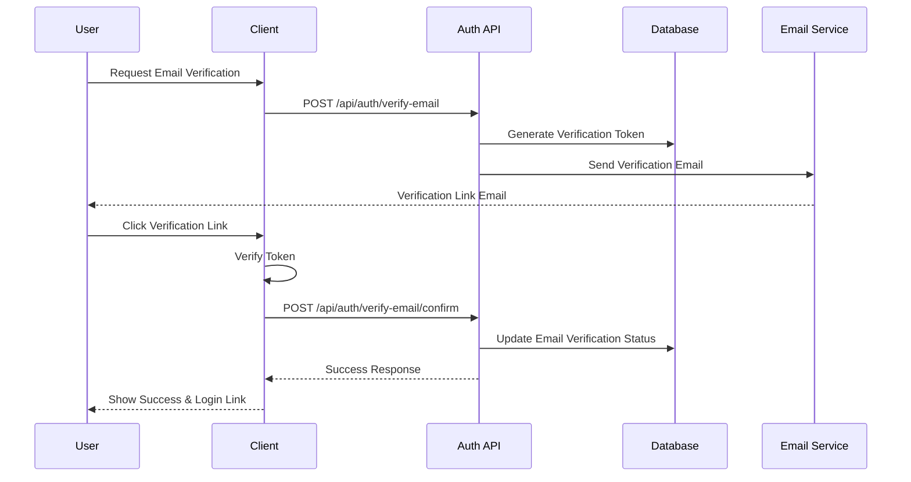

# Authentication Flow Documentation

## Overview
This document outlines the authentication flows implemented in our application, including email/password authentication, social authentication, password reset processes, and email verification.

## Authentication Flows

### 1. Email/Password Authentication Flow



### 2. Social Authentication Flow



### 3. Password Reset Flow



### 4. Email Verification Flow



## Security Considerations

1. **Rate Limiting**
   - Login attempts are limited to prevent brute force attacks
   - Password reset requests are rate-limited per email
   - Email verification requests are rate-limited per email

2. **Session Management**
   - Sessions expire after period of inactivity
   - Invalid sessions are immediately revoked
   - Multiple sessions per user are tracked

3. **Error Handling**
   - Generic error messages to prevent user enumeration
   - Detailed logging for debugging (without sensitive data)

4. **Data Protection**
   - Passwords are hashed using bcrypt
   - Reset tokens are single-use and time-limited
   - Verification tokens are single-use and time-limited
   - All API endpoints use HTTPS

## Implementation Status

- [x] Basic email/password authentication
- [x] Social authentication framework
- [x] Rate limiting implementation
  - ✓ Login attempts (5/5min)
  - ✓ Password reset (3/hour)
  - ✓ Registration (3/hour)
  - ✓ Email verification (3/hour)
- [x] Password reset flow
  - ✓ Secure token generation
  - ✓ Token expiration (1 hour)
  - ✓ Rate limiting
  - ✓ Two-step reset process
- [x] Email verification flow
  - ✓ Secure token generation
  - ✓ Token expiration (1 hour)
  - ✓ Rate limiting
  - ✓ Two-step verification process
- [x] Session management
  - ✓ Iron Session implementation
  - ✓ Session timeout
  - ✓ Secure cookie handling
- [ ] Security hardening
  - ✓ Rate limiting
  - [ ] CSRF protection
  - [ ] Security headers
  - [ ] Input validation

## Token-based Systems

### Token Types
1. Password Reset Tokens
   - 32-byte random tokens
   - 1-hour expiration
   - Single-use only
   - Hashed storage

2. Email Verification Tokens
   - 32-byte random tokens
   - 1-hour expiration
   - Single-use only
   - Hashed storage

### Token Security Measures
- Secure random generation using crypto
- SHA-256 hashing before storage
- Automatic cleanup of expired tokens
- Rate limiting on token generation
- Prevention of token enumeration attacks

## Database Schema

```prisma
model Token {
  id        String    @id @default(cuid())
  token     String    @unique
  type      String
  expiresAt DateTime
  createdAt DateTime  @default(now())
  user      User      @relation(fields: [userId], references: [id], onDelete: Cascade)
  userId    String

  @@index([token])
  @@index([userId])
}
```

## Next Steps

1. Complete email delivery system for password reset and email verification
   - Implement email sending using a mail service
   - Add email templates for password reset and email verification

2. Enhance security measures
   - Add CSRF protection
   - Implement security headers
   - Strengthen input validation
   - Add request sanitization

3. Improve error handling
   - Add detailed error logging
   - Implement user-friendly error messages
   - Add error tracking and monitoring

4. Add monitoring and analytics
   - Track authentication attempts
   - Monitor rate limit hits
   - Log security events
   - Track session statistics
