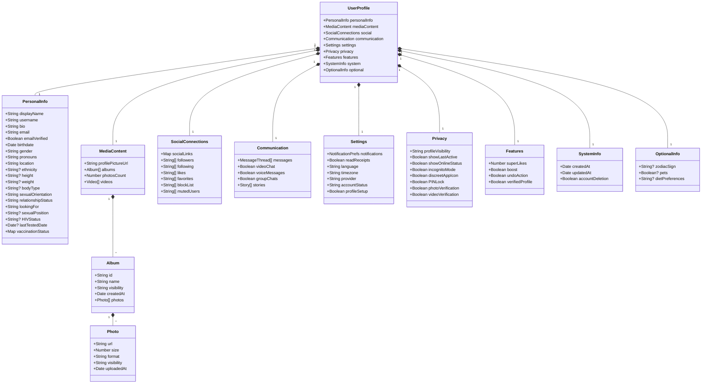

# Profile Schema Documentation

This document outlines the complete schema structure for user profiles in the Rorny dating app.

## Visual Schema Structure



## Core Schema Structure

### Personal Information
```typescript
{
  displayName: string;        // Public name/alias (0-500 chars)
  username: string;          // Unique username
  bio: string;              // Bio/about me (max 255 chars)
  email: string;            // User email address
  emailVerified: boolean;   // Email verification status
  birthdate: Date;          // User birthdate
  gender: string;           // Gender identity
  pronouns: string;         // Preferred pronouns
  location: string;         // City, region
  ethnicity?: string;       // Optional ethnicity
  height?: string;          // Optional height
  weight?: string;          // Optional weight
  bodyType?: string;        // e.g., slim, average, toned
  sexualOrientation: string; // e.g., straight, gay, bi
  relationshipStatus: string; // Current relationship status
  lookingFor: string;       // Intent (chat, dates, etc.)
  sexualPosition?: string;  // Optional position preference
  HIVStatus?: string;       // Optional HIV status
  lastTestedDate?: Date;    // Last HIV test date
  vaccinationStatus: {      // Vaccination information
    [key: string]: {
      status: string;
      date: Date;
    }
  }
}
```

### Media & Photos
```typescript
{
  profilePictureUrl: string;  // Main profile picture URL
  albums: Array<{
    id: string;
    name: string;
    visibility: 'public' | 'private';
    createdAt: Date;
    photos: Array<{
      url: string;
      size: number;
      format: string;
      visibility: string;
      uploadedAt: Date;
    }>
  }>;
  photosCount: number;      // Total photo count
  videos: Array<{
    url: string;
    thumbnail: string;
    duration: number;
    uploadedAt: Date;
  }>;
}
```

### Social & Connections
```typescript
{
  socialLinks: {           // Social media profiles
    [platform: string]: string;
  };
  followers: string[];     // User IDs of followers
  following: string[];     // User IDs being followed
  likes: string[];        // Liked content IDs
  favorites: string[];    // Favorited content IDs
  blockList: string[];    // Blocked user IDs
  mutedUsers: string[];   // Muted user IDs
}
```

### Communication
```typescript
{
  messages: Array<{
    threadId: string;
    participants: string[];
    lastMessage: {
      content: string;
      timestamp: Date;
      read: boolean;
    }
  }>;
  videoChat: boolean;     // Video chat enabled
  voiceMessages: boolean; // Voice messages enabled
  groupChats: boolean;    // Group chats enabled
  stories: Array<{
    url: string;
    type: 'image' | 'video';
    createdAt: Date;
    expiresAt: Date;
  }>;
}
```

### Settings & Preferences
```typescript
{
  notifications: {
    push: boolean;
    email: boolean;
    marketing: boolean;
  };
  readReceipts: boolean;
  language: string;
  timezone: string;
  provider: string;       // Auth provider
  accountStatus: 'active' | 'suspended' | 'deleted';
  profileSetup: boolean;
}
```

### Privacy & Safety
```typescript
{
  profileVisibility: 'public' | 'private' | 'friends';
  showLastActive: boolean;
  showOnlineStatus: boolean;
  incognitoMode: boolean;
  discreetAppIcon: boolean;
  PINLock: boolean;
  photoVerification: boolean;
  videoVerification: boolean;
}
```

### Features & Capabilities
```typescript
{
  superLikes: number;
  boost: boolean;
  undoAction: boolean;
  verifiedProfile: boolean;
}
```

### System Fields
```typescript
{
  createdAt: Date;        // Account creation timestamp
  updatedAt: Date;        // Last update timestamp
  accountDeletion: boolean; // Account deletion capability
}
```

### Optional Fields
```typescript
{
  zodiacSign?: string;
  pets?: boolean;
  dietPreferences?: string;
}
```

## Usage Notes

1. All timestamps should be stored in UTC format
2. Optional fields are marked with `?`
3. Arrays should be indexed for performance
4. Sensitive fields (HIV status, etc.) should be encrypted at rest
5. File URLs should use CDN paths for better performance
6. All string fields should have appropriate length validation

## Security Considerations

1. Personal information must be encrypted at rest
2. Access to sensitive fields should be restricted
3. File uploads must be validated for type and size
4. Authentication tokens should be rotated regularly
5. Rate limiting should be implemented for all API endpoints
