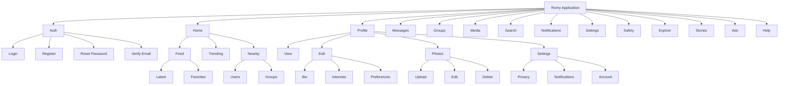
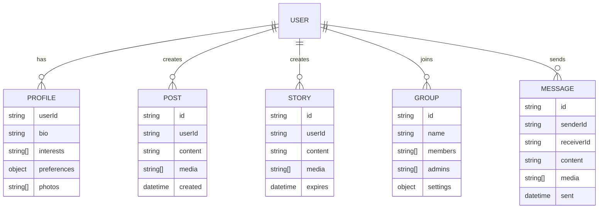
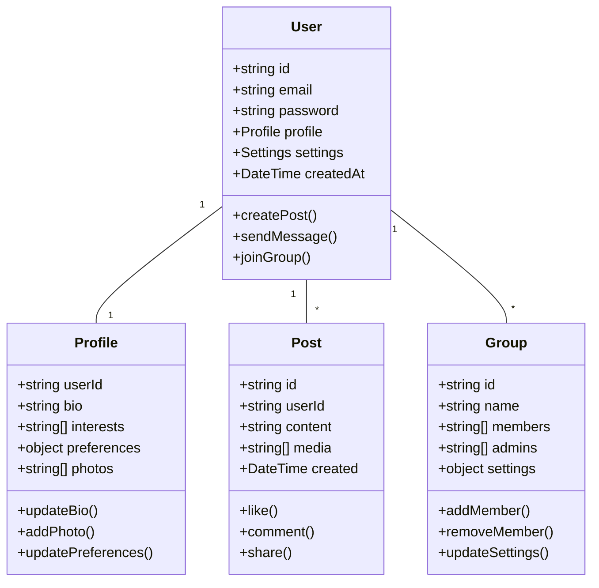

# Rorny Application Schema Documentation

## Table of Contents
1. [Component Hierarchy](#component-hierarchy)
2. [Feature Relationships](#feature-relationships)
3. [Data Models](#data-models)
4. [Route Structure](#route-structure)

## Component Hierarchy



## Feature Relationships



## Data Models



## Route Structure

```mermaid
graph LR
    %% Auth Routes
    auth[/auth] --> login[/login]
    auth --> register[/register]
    auth --> reset[/reset-password]
    auth --> verify[/verify-email]

    %% Profile Routes
    profile[/profile] --> view[/view/:userId]
    profile --> edit[/edit/*]
    profile --> photos[/photos/*]
    profile --> settings[/settings/*]

    %% Messages Routes
    messages[/messages] --> inbox[/inbox]
    messages --> conversation[/conversation/:id]
    conversation --> media[/media]
    conversation --> details[/details]

    %% Groups Routes
    groups[/groups] --> explore[/explore]
    groups --> create[/create]
    groups --> groupId[/:groupId]
    groupId --> members[/members]
    groupId --> chat[/chat]
    groupId --> settings2[/settings]
```

## Component Properties

### Auth Component
```typescript
interface AuthComponent {
    features: {
        login: {
            path: '/auth/login'
            methods: ['POST']
            inputs: {
                email: string
                password: string
            }
        }
        register: {
            path: '/auth/register'
            methods: ['POST']
            inputs: {
                email: string
                password: string
                name: string
            }
        }
        resetPassword: {
            path: '/auth/reset-password'
            methods: ['POST']
            inputs: {
                email: string
            }
        }
        verifyEmail: {
            path: '/auth/verify-email'
            methods: ['GET', 'POST']
            inputs: {
                token: string
            }
        }
    }
}
```

### Profile Component
```typescript
interface ProfileComponent {
    features: {
        view: {
            path: '/profile/view/:userId'
            methods: ['GET']
            params: {
                userId: string
            }
        }
        editBio: {
            path: '/profile/edit/bio'
            methods: ['PUT']
            inputs: {
                bio: string
                interests: string[]
            }
        }
        photos: {
            path: '/profile/photos'
            methods: ['GET', 'POST', 'DELETE']
            inputs: {
                photoId?: string
                photo?: File
            }
        }
        settings: {
            path: '/profile/settings'
            methods: ['GET', 'PUT']
            sections: {
                privacy: PrivacySettings
                notifications: NotificationSettings
                account: AccountSettings
            }
        }
    }
}
```

### Messages Component
```typescript
interface MessagesComponent {
    features: {
        inbox: {
            path: '/messages/inbox'
            methods: ['GET']
            filters: {
                unread?: boolean
                archived?: boolean
            }
        }
        conversation: {
            path: '/messages/:conversationId'
            methods: ['GET', 'POST']
            params: {
                conversationId: string
            }
            features: {
                media: {
                    path: '/media'
                    methods: ['GET', 'POST']
                    types: ['photos', 'videos', 'files']
                }
                settings: {
                    path: '/settings'
                    methods: ['GET', 'PUT']
                    actions: ['block', 'mute', 'report']
                }
            }
        }
    }
}
```

### Groups Component
```typescript
interface GroupsComponent {
    features: {
        explore: {
            path: '/groups/explore'
            methods: ['GET']
            filters: {
                new?: boolean
                popular?: boolean
                nearby?: boolean
            }
        }
        create: {
            path: '/groups/create'
            methods: ['POST']
            inputs: {
                name: string
                description: string
                privacy: 'public' | 'private'
                settings: GroupSettings
            }
        }
        manage: {
            path: '/groups/:groupId'
            methods: ['GET', 'PUT', 'DELETE']
            features: {
                members: {
                    path: '/members'
                    actions: ['list', 'add', 'remove', 'promote']
                }
                media: {
                    path: '/media'
                    actions: ['upload', 'view', 'edit', 'delete']
                }
                chat: {
                    path: '/chat'
                    features: ['messages', 'pinned', 'search']
                }
            }
        }
    }
}
```
