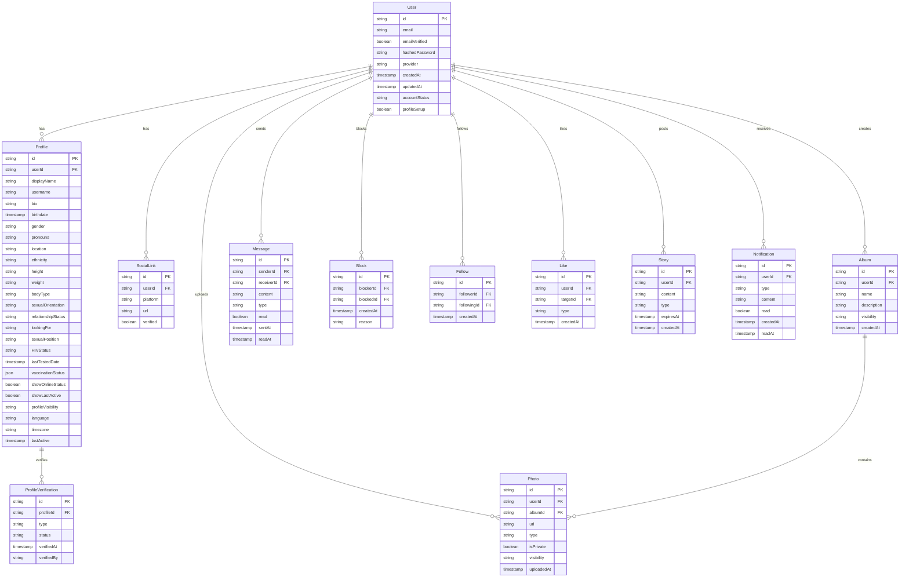

# Database Schema Documentation

## Overview
The database schema is designed to support a modern dating application with comprehensive user profiles, social features, and security considerations. The implementation uses Prisma with PostgreSQL as the primary database.

## Entity Relationship Diagram



## Schema Details

### User
Core user account information and authentication details.
- Primary authentication and account management
- Linked to all other entities
- Stores essential account metadata

### Profile
Detailed user profile information.
- Personal information and preferences
- Privacy settings
- Location and demographic data
- Health and status information

### ProfileVerification
Verification status for user profiles.
- Photo verification
- Identity verification
- Health status verification
- Document verification

### SocialLink
Connected social media accounts.
- Platform links
- Verification status
- Social media integration

### Photo
User photos and media.
- Profile pictures
- Album photos
- Private photos
- Media metadata

### Album
Photo collections and organization.
- Public/private albums
- Photo grouping
- Visibility controls

### Message
Private messaging system.
- Direct messages
- Message status
- Read receipts
- Message types (text, media)

### Block
User blocking functionality.
- Block records
- Block reasons
- Block duration

### Follow
User following/follower system.
- Follow relationships
- Follow status
- Follow notifications

### Like
Like/favorite system.
- Profile likes
- Photo likes
- Story likes
- Content engagement

### Story
Temporary content sharing.
- Story content
- Expiration
- Visibility
- Media types

### Notification
User notification system.
- System notifications
- User interactions
- Read status
- Notification preferences

## Security Considerations

### Data Protection
- Passwords are never stored directly
- Sensitive information is encrypted
- Personal data is protected according to GDPR

### Privacy
- Visibility controls for all content
- Granular privacy settings
- Block and report functionality

### Verification
- Email verification
- Phone verification
- Photo verification
- Identity verification

## Performance Optimizations

### Indexes
```sql
-- User indexes
CREATE INDEX idx_user_email ON "User"(email);
CREATE INDEX idx_user_username ON "Profile"(username);

-- Location indexes
CREATE INDEX idx_profile_location ON "Profile" USING GiST (location);

-- Timestamp indexes
CREATE INDEX idx_message_sent ON "Message"(sentAt);
CREATE INDEX idx_story_expires ON "Story"(expiresAt);

-- Relationship indexes
CREATE INDEX idx_follow_composite ON "Follow"(followerId, followingId);
CREATE INDEX idx_block_composite ON "Block"(blockerId, blockedId);
```

### Partitioning
- Messages partitioned by date
- Photos partitioned by user
- Stories partitioned by expiration

## Data Migration
```prisma
// Example migration
prisma migrate dev --name init
```

## Backup Strategy
- Daily full backups
- Hourly incremental backups
- Point-in-time recovery
- Geo-redundant storage

## Monitoring
- Query performance monitoring
- Storage usage tracking
- Connection pool metrics
- Cache hit ratios

## Next Steps
1. Implement full-text search
2. Add geospatial queries
3. Optimize for scale
4. Implement sharding strategy
5. Add analytics tables
