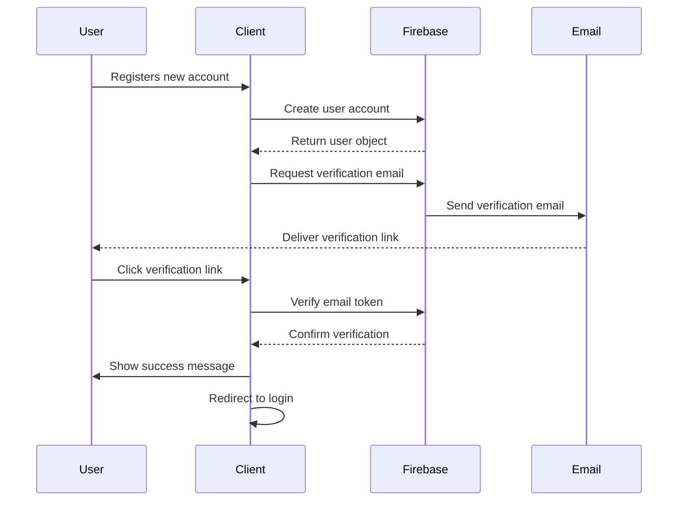

# Email Verification System

## Overview
The email verification system uses Firebase Authentication to ensure user email authenticity. This document outlines the implementation, flow, and security considerations.

## Implementation Components

### 1. Firebase Authentication Service
Location: `/src/lib/firebase/auth.ts`
- Handles email verification token generation
- Manages verification status
- Provides verification email delivery
- Integrates with Firebase's secure email system

### 2. Verification Page
Location: `/src/app/(auth)/verify-email/page.tsx`
- Processes verification links
- Shows verification status
- Handles verification errors
- Provides resend functionality

### 3. Registration Integration
Location: `/src/app/(auth)/register/page.tsx`
- Automatically triggers verification on registration
- Redirects to verification page
- Provides clear user feedback

## Flow Diagram



## Security Considerations

### Rate Limiting
- Verification email requests: 3 per hour
- Verification attempts: 5 per hour
- Implemented using Upstash Redis

### Token Security
- Firebase-generated secure tokens
- One-time use verification links
- 24-hour token expiration
- Secure email delivery

### Error Handling
- Invalid token detection
- Expired token handling
- Rate limit notifications
- Clear user feedback

## User Experience

### States
1. **Waiting**
   - Shows instructions to check email
   - Offers resend option
   - Clear next steps

2. **Verifying**
   - Loading indicator
   - Progress feedback
   - Error handling

3. **Success**
   - Confirmation message
   - Redirect to login
   - Clear completion

4. **Error**
   - Clear error message
   - Resend option
   - Support contact

## Implementation Details

### Firebase Configuration
```typescript
const actionCodeSettings = {
  url: `${process.env.NEXT_PUBLIC_APP_URL}/verify-email`,
  handleCodeInApp: true
}
```

### Verification Functions
```typescript
// Send verification email
async function sendVerificationEmail(): Promise<boolean>

// Verify email token
async function verifyEmail(code: string): Promise<boolean>

// Create user with verification
async function createUserWithVerification(
  email: string,
  password: string
): Promise<User | null>
```

## Testing

### Test Cases
1. Successful verification flow
2. Expired token handling
3. Invalid token handling
4. Rate limit testing
5. Resend functionality
6. Error scenarios

### Test Commands
```bash
# Run verification tests
npm run test:verification

# Test email delivery
npm run test:email
```

## Monitoring

### Metrics to Track
- Verification success rate
- Average verification time
- Email delivery rate
- Error frequency
- Resend rate

### Firebase Analytics Events
- `verification_email_sent`
- `verification_completed`
- `verification_failed`
- `verification_resent`

## Troubleshooting

### Common Issues
1. Email not received
   - Check spam folder
   - Verify email address
   - Request resend

2. Invalid link
   - Check link expiration
   - Request new link
   - Contact support

3. Rate limiting
   - Wait for cooldown
   - Contact support
   - Check for abuse

## Next Steps

### Planned Improvements
1. Add email templates customization
2. Implement analytics dashboard
3. Add multi-language support
4. Enhance error reporting
5. Add abuse prevention
