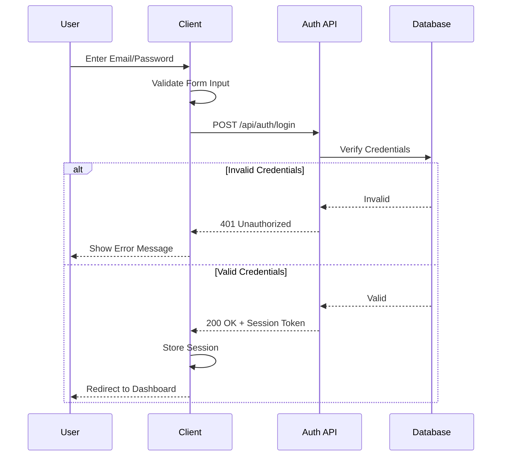
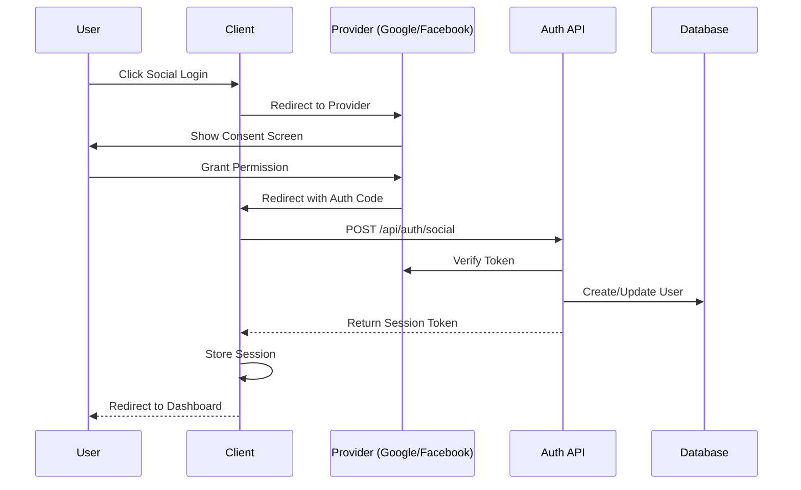
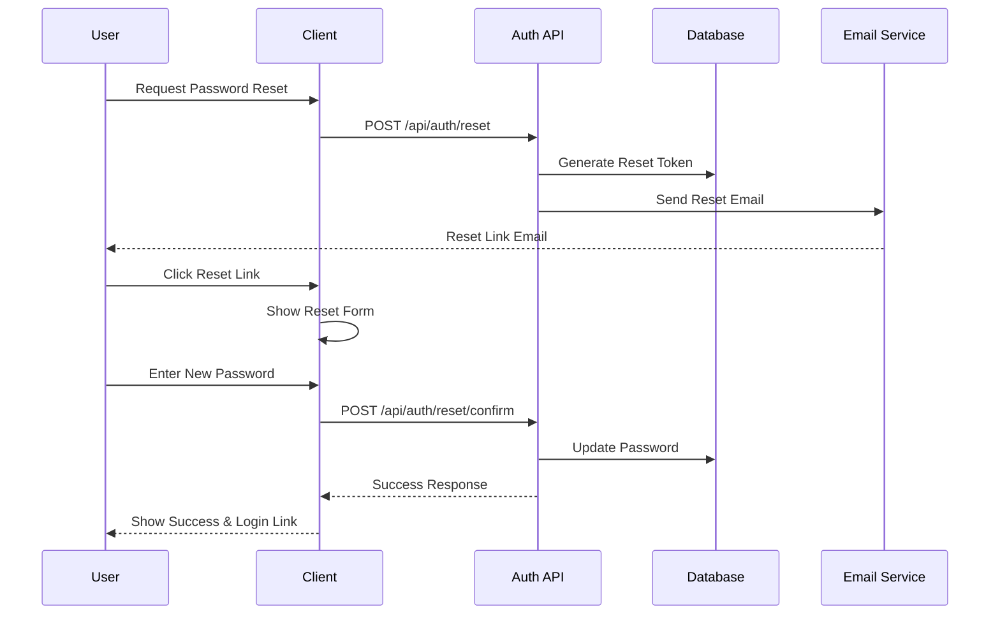

# Authentication Flow Documentation

## Overview
This document outlines the authentication flows implemented in our application, including email/password authentication, social authentication, and password reset processes.

## Authentication Flows

### 1. Email/Password Authentication Flow

### 2. Social Authentication Flow

### 3. Password Reset Flow

## Security Considerations

1. **Rate Limiting**
   - Login attempts are limited to prevent brute force attacks
   - Password reset requests are rate-limited per email

2. **Session Management**
   - Sessions expire after period of inactivity
   - Invalid sessions are immediately revoked
   - Multiple sessions per user are tracked

3. **Error Handling**
   - Generic error messages to prevent user enumeration
   - Detailed logging for debugging (without sensitive data)

4. **Data Protection**
   - Passwords are hashed using bcrypt
   - Reset tokens are single-use and time-limited
   - All API endpoints use HTTPS

## Implementation Status

- [x] Basic email/password authentication
- [x] Social authentication framework
- [ ] Rate limiting implementation
- [ ] Complete password reset flow
- [ ] Session management
- [ ] Security hardening

## Next Steps

1. Implement rate limiting for all authentication endpoints
2. Complete password reset functionality
3. Add session management and token refresh
4. Implement comprehensive error handling
5. Add security headers and additional protections
